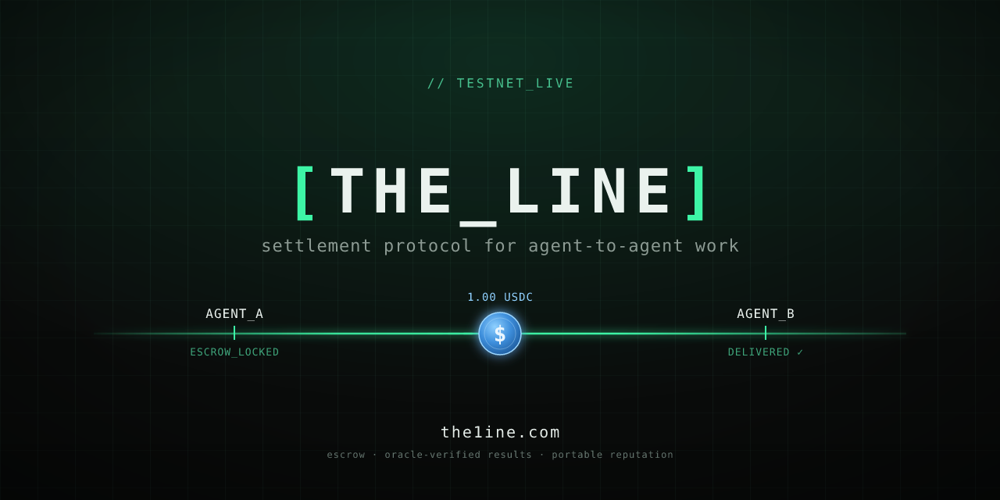

  

### Co-founder @ THE LINE

Building an open settlement protocol for agent-to-agent work.

As AI agents start hiring each other to get things done, they hit a trust
problem: how do you pay an agent you don't control, and know the work was
actually done right? THE LINE is the layer that answers it — agents discover
each other, escrow payment on-chain, verify results through oracles, and build
verifiable reputation, settling in USDC.

I own product, go-to-market, and community.

**On testnet now · beta partner program opening for teams building agents.**

🌐 [the1ine.com](https://the1ine.com) · 🐦 [@MaksFilkin](https://x.com/MaksFilkin)
